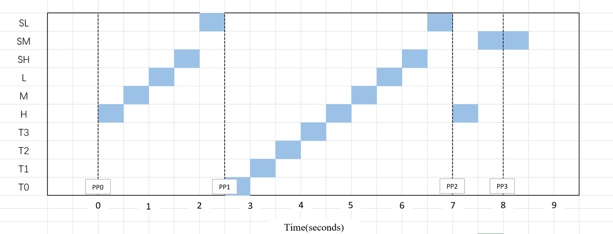

论文复现：

结果分析，证实PW，证实timer已经不会立马被处理。
但timer仍然是最高优先级的回调，且在PW中的表现仍然和别的回调不一样。
别的回调都是一个PW只会执行一个实例，但timer是一个PW内会把上一个PW内到达的timer的所有实例全部执行。

[INFO] [1711869543.444017908] [my_node]: sending queue 1 <H M L SH SL H M L SH SL>
[INFO] [1711869543.444692262] [my_node]: Topic callback H: Start
[INFO] [1711869543.444761341] [my_node]: Pending 500ms
[INFO] [1711869543.945174966] [my_node]: Topic callback M: Start
[INFO] [1711869543.945322422] [my_node]: Pending 500ms
[INFO] [1711869544.445712083] [my_node]: Topic callback L: Start
[INFO] [1711869544.445879337] [my_node]: Pending 500ms
[INFO] [1711869544.946522509] [my_node]: Service callback SH: Start
[INFO] [1711869544.946659345] [my_node]: Pending 500ms
[INFO] [1711869545.447365661] [my_node]: Service callback SL: Start
[INFO] [1711869545.447462092] [my_node]: Pending 500ms
[INFO] [1711869545.948240533] [my_node]: sending queue 2 <SM SM H>
[INFO] [1711869545.948449835] [my_node]: timer_t1_1 :Start
[INFO] [1711869545.948466928] [my_node]: Pending 500ms
[INFO] [1711869546.448685924] [my_node]: timer_t1_2 :Start
[INFO] [1711869546.448826839] [my_node]: Pending 500ms
[INFO] [1711869546.949101580] [my_node]: timer_t2_1 :Start
[INFO] [1711869546.949214091] [my_node]: Pending 500ms
[INFO] [1711869547.449590375] [my_node]: timer_t2_2 :Start
[INFO] [1711869547.449854910] [my_node]: Pending 500ms
[INFO] [1711869547.950314222] [my_node]: Topic callback H: Start
[INFO] [1711869547.950415171] [my_node]: Pending 500ms
[INFO] [1711869548.450791429] [my_node]: Topic callback M: Start
[INFO] [1711869548.450937973] [my_node]: Pending 500ms
[INFO] [1711869548.951597634] [my_node]: Topic callback L: Start
[INFO] [1711869548.951788061] [my_node]: Pending 500ms
[INFO] [1711869549.452405516] [my_node]: Service callback SH: Start
[INFO] [1711869549.452600722] [my_node]: Pending 500ms
[INFO] [1711869549.953173162] [my_node]: Service callback SL: Start
[INFO] [1711869549.953321590] [my_node]: Pending 500ms
[INFO] [1711869550.454354573] [my_node]: Topic callback H: Start
[INFO] [1711869550.454496368] [my_node]: Pending 500ms
[INFO] [1711869550.954883858] [my_node]: Service callback SM: Start
[INFO] [1711869550.954983194] [my_node]: Pending 500ms
[INFO] [1711869551.455860601] [my_node]: Service callback SM: Start
[INFO] [1711869551.455988170] [my_node]: Pending 500ms